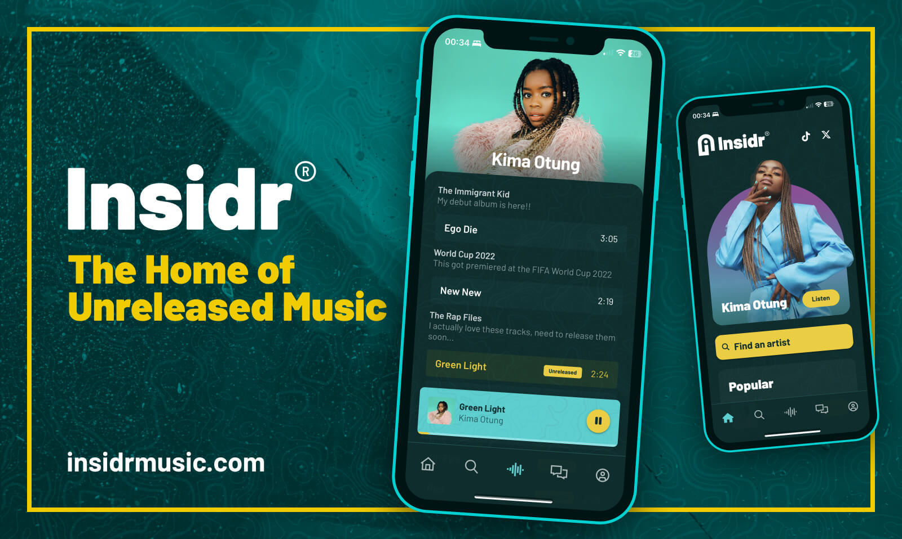

# Insidr

## The Home of Unreleased Music

[](https://app.netlify.com/sites/insidr-docs/deploys)

[READ: Insidr Documentation](https://docs.insidrmusic.com/)



[Insidr](https://insidrmusic.com/) is the open source Spotify-meets-Patreon music streaming platform.

## How does Insidr work for music artists?

1. **Fans subscribe to you** - Your fans - your _Insidrs_ - pay a monthly subscription price that you as the artist sets

2. **Fans stream your unreleased music** - Your Insidrs now get access to stream your released and unreleased music

3. **Fans engage with your content** - Your Insidrs now get access to stream your released and unreleased music

4. **You, the artist, get paid** - Artists get paid every month. With Insidr, you'll earn 4000% more than you do on other music streaming platforms.

## Stack

- [Quasar framework](https://quasar.dev/)
- [Supabase](https://supabase.com/)
- [Starlight (Docs)](https://starlight.astro.build/)
- [Netlify](https://www.netlify.com/)

## Run

**App** - Fan-facing app

```bash
cd apps/app
quasar dev
```

**Artist** - Artist dashboard

```bash
cd apps/artist
quasar dev
```

**Docs**

```bash
cd apps/docs
yarn run dev
```

## Contributing

Hi there! I'm [Dan](https://x.com/RealDanRyland), the co-founder and chief tech guy at Insidr. This is going to be fun. This is my first-ever open-source project. Expect a journey filled with iteration, collaboration and plenty learning. I hope you'll join me along the way!

## Licence

See [License](LICENSE)
